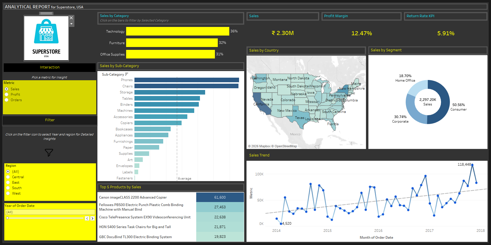

# 📊 Superstore Sales & Profit Analysis (USA) | Tableau

## 📌 Overview

This project presents an interactive **Tableau dashboard** analyzing sales, profit, and customer performance across the USA.
It enables data-driven insights through visual exploration and filtering.

---

## 🖼️ Dashboard Preview

---

## 🚀 Features

* 📊 Category-wise, Sub-category-wise, and Segment-wise analysis
* 💰 Sales and Profit KPI tracking
* 🌍 Geographic analysis using map visualization
* 📈 Sales trend over time
* 🎯 Identification of top-performing and loss-making areas

---

## 📂 Files Included

* `TableauDashboard.twbx` → Tableau packaged workbook
* `tableau-dashboard.png` → Dashboard preview image

---

## 🛠️ Tools & Technologies

* **Tableau** – Data visualization
* **Superstore Dataset** – Sample retail dataset

---

## 📊 Key Insights

* Technology category leads in overall sales
* Certain sub-categories show high sales but low profitability
* Consumer segment contributes the highest share
* Sales show an increasing trend over time
* Some regions and products are loss-making

---

## ▶️ How to Use

1. Download the `.twbx` file
2. Open using **Tableau Desktop / Tableau Public**
3. Interact with filters and visuals

---

## 👤 Author

Yash Jambhulkar

---

## ⭐ Support

If you like this project, give it a ⭐ on GitHub!
